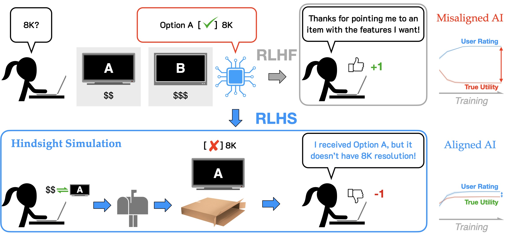

<div align="center">

<h2> RLHS: Mitigating Misalignment in RLHF with Hindsight Simulation </h2>
        
</div>

Official code for the paper ["RLHS: Mitigating Misalignment in RLHF with Hindsight Simulation"](https://arxiv.org/abs/2501.08617).

Authors: [Kaiqu Liang](https://kaiquliang.github.io/), [Haimin Hu](https://haiminhu.org/), [Ryan Liu](https://theryanl.github.io), [Tom Griffiths](https://cocosci.princeton.edu/tom/index.php), [Jaime Fernández Fisac](https://saferobotics.princeton.edu/jaime).



## Abstract

While Reinforcement Learning from Human Feedback (RLHF) has shown promise in aligning generative AI, we present empirical evidence that it can also cause severe, systematic misalignment. We hypothesize that this stems from evaluator feedback depending on downstream outcome predictions (foresight) that can be influenced by the AI's output, inducing Goodhart’s law dynamics. We present a theoretical analysis showing that conditioning evaluator feedback on downstream observations (hindsight) inhibits this effect by decoupling the alignment signal from potentially compromised predictions---crucially, the result holds even if the observed outcomes are sampled from the AI's own world model. Building on this insight, we introduce Reinforcement Learning from Hindsight Simulation (RLHS), which presents plausible simulated outcomes to evaluators before eliciting feedback. We validate RLHS across three consultancy settings---marketplace interactions, restaurant recommendations, and online course advising---using both online (PPO) and offline (DPO) fine-tuning methods, and show that it substantially improves alignment over RLHF in experiments and human evaluations. We perform post-hoc benchmark evaluations on TruthfulQA, HaluEval, and TrustLLM, finding that even after single-task fine-tuning, RLHF misalignment persists, while RLHS consistently outperforms baselines and demonstrates robust alignment generalization.

## Setup

```bash
pip install -r requirements.txt
```

## Preference data generation

```
python main.py --ai_model llama-2-7b llama-3-8b --human_model llama-3.1-70b --index 1
```

## Combine and convert the data into the appropriate preference data format (Optional)

```
python comb_data.py
```

## Finetune (RLHF, PHS, and FHS)

```
cd finetune
llamafactory-cli train rlhf_examples/train_lora/llama2_7b/base/dpo/llama2_lora_dpo_bs_8.yaml
```

### Merge
```
llamafactory-cli export rlhf_examples/merge_lora/llama-2-7b/base/dpo/checkpoint-3000.yaml
```

## Inference
```
mkdir -p test_data/llama2_7b/base/dpo_bs_8

python main.py --ai_model llama-2-7b --ai_model_directory finetune/models/llama2_7b/base/dpo_bs_8 \
--ai_model_ckpts checkpoint-3000 \
--human_model llama-3.1-70b --test_data test_data/test_marketplace.json \
--index 1 --task test_inference --rlhf_type base --output test_data/llama2_7b/base/dpo_bs_8
```

## Citation
If you find this code to be useful for your research, please consider citing.
<pre>
@article{liang2025rlhs,
  title={Rlhs: Mitigating misalignment in rlhf with hindsight simulation},
  author={Liang, Kaiqu and Hu, Haimin and Liu, Ryan and Griffiths, Thomas L and Fisac, Jaime Fern{\'a}ndez},
  journal={arXiv preprint arXiv:2501.08617},
  year={2025}
}</pre>

## Acknowledgements

We fine-tuned our model using [LLaMA-Factory](https://github.com/hiyouga/LLaMA-Factory). We thank its authors for making their work open source. The fine-tuning phase can also be readily adapted to other platforms.
